# 一次性搞定授权与认证02--OAuth

这又是一张能相对清晰说明白 oauth 的图，让我们展开说说


---

## 一、概述

OAuth（Open Authorization）是一种**开放的授权协议**，允许用户将其在某个服务上的私有资源（如个人信息、照片、视频等）共享给第三方应用，而无需将用户名和密码直接提供给第三方。

### 常见应用场景

| 场景 | 说明 |
| --- | --- |
| 使用第三方登录 | 使用微信、GitHub、Twitter 等账号登录第三方应用 |
| 授权 API 访问 | 在你的应用前端通过自定义 OAuth 服务器进行授权 |
| 开放数据共享 | 将你在某平台的信息暴露给外部应用（如 Twitter 信息授权给第三方） |

> ⚠️ 以上两种场景的 OAuth 服务器不同：前者使用你自建的 OAuth 服务器，后者使用平台方（如 Twitter）的 OAuth 服务器。

### 版本演进

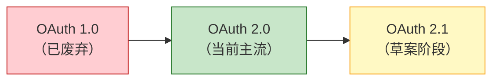

> ⚠️ OAuth 1.0 与 OAuth 2.0 **不向后兼容**。

---

## 二、OAuth 2.0 工作原理

OAuth 2.0 定义了 **4 种授权流程**（Grant Types），用于生成令牌（Token）。所有流程的最终目标都是获取一个 **Access Token**，客户端使用该令牌访问受保护的资源。

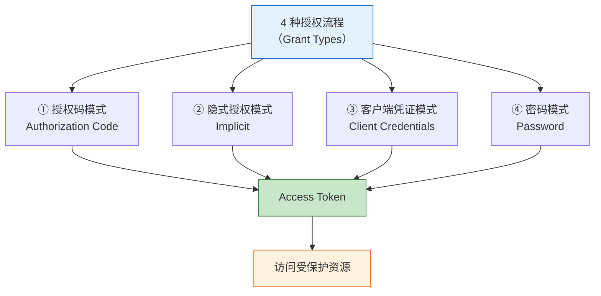

---

## 三、核心术语

| 术语 | 说明 |
| --- | --- |
| **client_id** | 客户端应用的唯一标识，类似"用户名" |
| **client_secret** | 客户端应用的密钥，类似"密码" |
| **authorization server** | 授权服务器，负责处理身份认证和授权 |
| **resource server** | 资源服务器，存放受保护的资源并对外提供 API |
| **access_token** | 访问令牌，客户端用来访问受保护资源 |
| **refresh_token** | 刷新令牌，用于在 access_token 过期后获取新令牌 |
| **scope** | 权限范围，定义令牌可以执行哪些操作 |
| **redirect_uri** | 重定向地址，用户登录成功后跳转回的地址 |
| **authorization_code** | 授权码，仅在授权码模式中使用的中间凭证 |

> 💡 授权服务器和资源服务器可以是同一台服务器，也可以分开部署。

---

## 四、授权码模式（Authorization Code Grant Flow）

这是 **最常用、最安全** 的授权流程，适用于有后端服务器的 Web 应用。

### 4.1 令牌请求参数

客户端发起令牌请求时，URL 的 Query 参数如下：

```json
{
  "client_id": "[客户端ID]",
  "response_type": "code",
  "scope": "[权限范围]",
  "redirect_uri": "[重定向地址]",
  "state": "[状态参数]"
}
```

| 参数 | 说明 |
| --- | --- |
| `client_id` | 调用方应用的唯一标识 |
| `response_type` | 固定为 `code`，表示请求授权码 |
| `scope` | 请求的权限列表，如 `share_tweet`、`user_info` 等 |
| `redirect_uri` | 用户登录成功后，携带授权码跳转回的 URL |
| `state` | 自定义状态参数，原样返回给客户端，用于防止 CSRF 攻击 |

### 4.2 完整流程

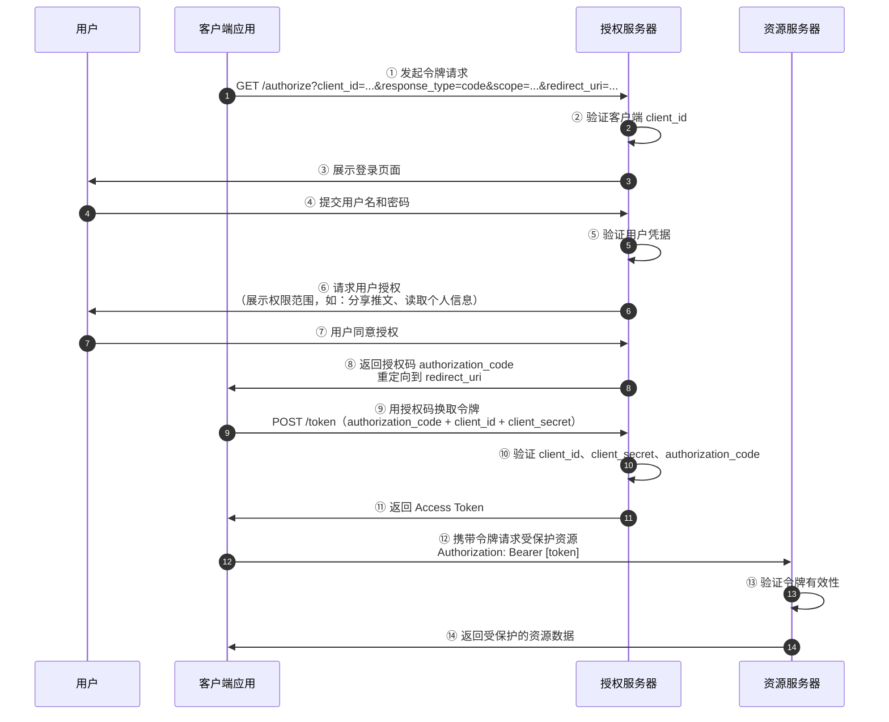

### 4.3 流程详解

| 步骤 | 说明 |
| --- | --- |
| ① | 客户端应用向授权服务器发起授权请求，携带 `client_id`、`scope`、`redirect_uri` 等参数 |
| ② | 授权服务器验证 `client_id` 是否合法 |
| ③ | 授权服务器向用户展示登录表单 |
| ④ | 用户输入用户名和密码 |
| ⑤ | 授权服务器验证用户凭据 |
| ⑥ | 授权服务器向用户展示权限授权页面（如：允许读取个人信息、发布推文等） |
| ⑦ | 用户同意授权 |
| ⑧ | 授权服务器生成 `authorization_code`，通过重定向将授权码发送给客户端应用 |
| ⑨ | 客户端应用使用授权码 + `client_id` + `client_secret` 向授权服务器请求令牌（**此步骤必须在服务端完成，因为涉及 client_secret**） |
| ⑩ | 授权服务器验证授权码、`client_id`、`client_secret` |
| ⑪ | 验证通过后，返回 Access Token |
| ⑫ | 客户端使用 Access Token 向资源服务器请求受保护资源 |
| ⑬ | 资源服务器验证令牌（可自行验证或向授权服务器验证） |
| ⑭ | 验证通过，返回受保护的资源数据 |

### 4.4 关键安全要点

```
⚠️ 第 ⑨ 步必须在服务端（后端）完成
因为该请求包含 client_secret
如果在前端发起，client_secret 会暴露

⚠️ scope 限定了令牌的权限范围
生成的令牌只能执行用户授权的操作
例如只授权了 share_tweet 和 user_info
则令牌无法执行 delete_account 等操作

⚠️ state 参数用于防止 CSRF 攻击
客户端发送一个随机值
授权服务器原样返回
客户端验证 state 是否一致
```

---

## 五、隐式授权模式（Implicit Grant Flow）

### 5.1 概述

隐式授权模式与授权码模式类似，但有以下关键区别：

* **第 ⑧ 步直接返回 Token**，而不是授权码（authorization_code）
* 不需要第 ⑨、⑩、⑪ 步（不需要用授权码换取令牌）
* 令牌请求中 `response_type` 参数设置为 `token`（而非 `code`）

### 5.2 流程图

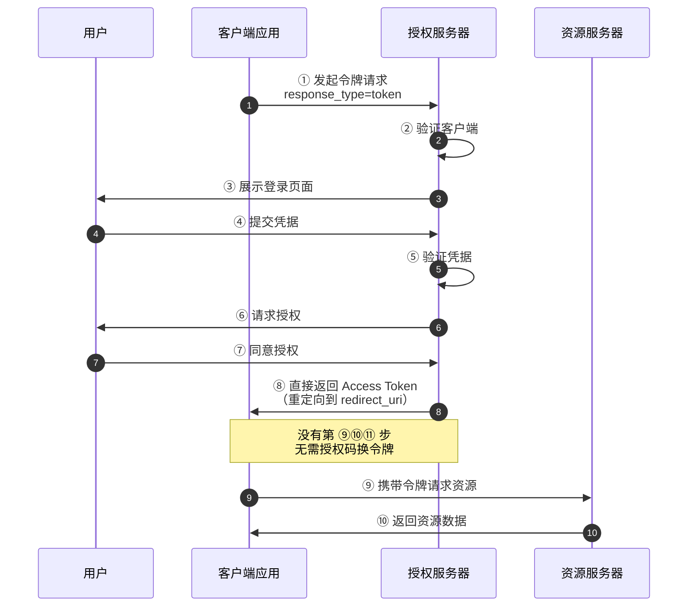

### 5.3 适用场景与安全警告

```
适用于：
→ 纯前端应用（SPA）
→ 没有后端服务器的场景

⚠️ 安全性较低：
→ Token 直接暴露在 URL 中
→ 没有 client_secret 验证
→ OAuth 2.1 草案中已建议废弃此模式
→ 建议改用 授权码模式 + PKCE
```

---

## 六、客户端凭证模式（Client Credentials Grant Flow）

### 6.1 概述

客户端凭证模式用于 **机器对机器（M2M）** 的场景，**没有用户参与**，客户端直接使用自身的凭证（`client_id` + `client_secret`）获取令牌。

关键特点：
* 流程直接从授权码模式的 **第 ⑨ 步开始**（即第 ⑨ 步变成第 ① 步）
* 请求中 **没有** `**authorization_code**`
* 增加参数 `grant_type` 设置为 `client_credentials`

### 6.2 流程图

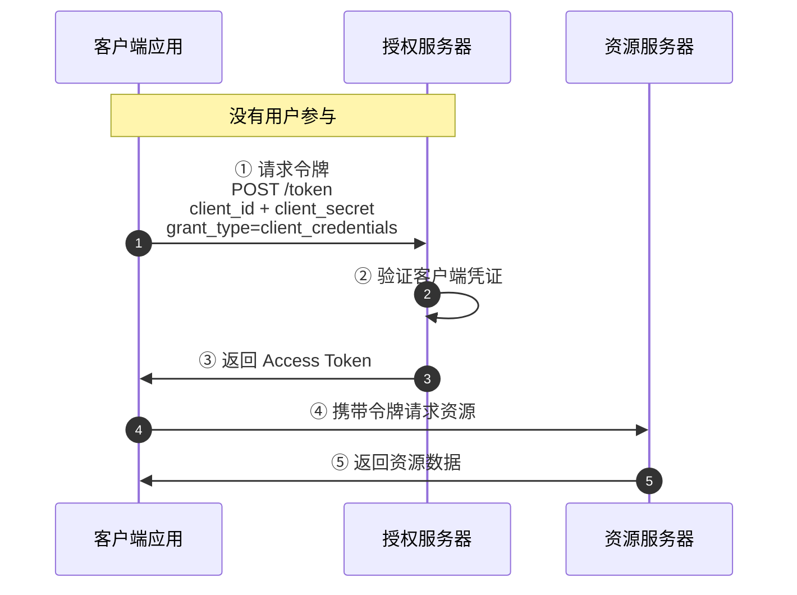

### 6.3 适用场景

```
适用于：
→ 服务间通信（微服务之间调用）
→ 后台定时任务
→ CLI 工具
→ 不涉及用户数据的 API 调用
```

---

## 七、密码模式（Password Grant Flow）

### 7.1 概述

密码模式中，用户将 **用户名和密码直接提供给客户端应用**，客户端应用代替用户向授权服务器发送凭据获取令牌。

关键特点：
* 授权码模式中的 **第 ④ 到第 ⑧ 步被替换** 为：客户端直接将用户凭据发送给授权服务器
* 增加参数 `grant_type` 设置为 `password`

### 7.2 流程图

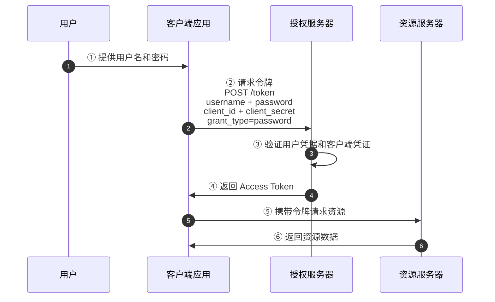

### 7.3 适用场景与安全警告

```
适用于：
→ 高度信任的第一方应用（如官方 App）
→ 用户与客户端之间有绝对信任关系的场景

⚠️ 安全风险极高：
→ 客户端直接接触用户的用户名和密码
→ 违背了 OAuth 的核心理念——委托授权
→ 扩大了攻击面，客户端需要安全处理和存储用户密码
→ 不支持多因素认证（MFA）
→ OAuth 2.1 草案中已建议废弃此模式
→ 建议改用 授权码模式 + PKCE
```

---

## 八、四种授权模式对比

| 特性 | 授权码模式 | 隐式授权模式 | 客户端凭证模式 | 密码模式 |
| --- | --- | --- | --- | --- |
| **安全性** | ⭐⭐⭐⭐⭐ 最高 | ⭐⭐ 低 | ⭐⭐⭐⭐ 高 | ⭐ 最低 |
| **是否需要用户参与** | ✅ 是 | ✅ 是 | ❌ 否 | ✅ 是 |
| **是否需要后端服务器** | ✅ 是 | ❌ 否 | ✅ 是 | ✅ 是 |
| **是否使用授权码** | ✅ 是 | ❌ 否 | ❌ 否 | ❌ 否 |
| **令牌暴露在浏览器** | ❌ 否 | ✅ 是 | ❌ 否 | ❌ 否 |
| **response_type** | `code` | `token` | — | — |
| **grant_type** | `authorization_code` | — | `client_credentials` | `password` |
| **适用场景** | Web 应用、移动端 | 纯前端 SPA | 机器对机器（M2M） | 高度信任的第一方应用 |
| **OAuth 2.1 状态** | ✅ 保留（强制 PKCE） | ❌ 已废弃 | ✅ 保留 | ❌ 已废弃 |

### 模式选择决策图

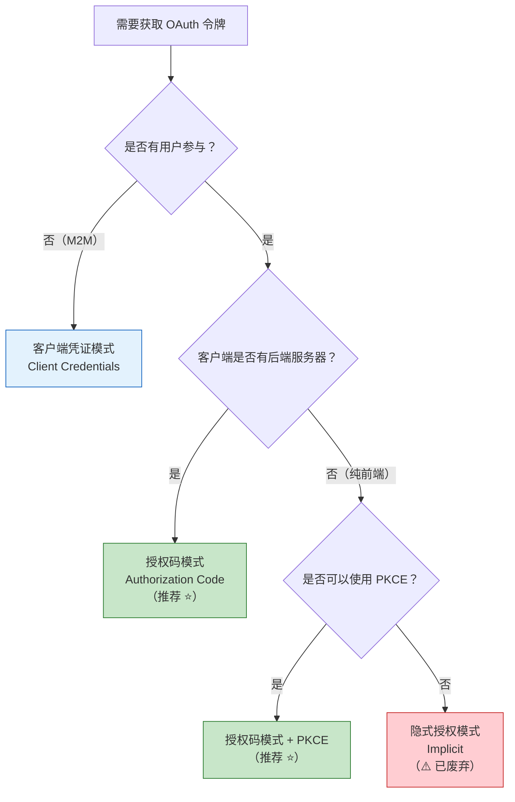

---

## 九、令牌（Token）机制

### 9.1 令牌响应

所有授权模式在成功获取令牌后，通常都会返回以下内容：

```json
{
  "access_token": "2YotnFZFEjr1zCsicMWpAA",
  "token_type": "Bearer",
  "expires_in": 3600,
  "refresh_token": "tGzv3JOkF0XG5Qx2TlKWIA"
}
```

| 字段 | 说明 |
| --- | --- |
| `access_token` | 访问令牌，用于访问受保护资源 |
| `token_type` | 令牌类型，通常为 `Bearer` |
| `expires_in` | 令牌有效期（秒），通常为 1 小时（3600 秒） |
| `refresh_token` | 刷新令牌，用于在 access_token 过期后获取新的令牌 |

### 9.2 令牌生命周期

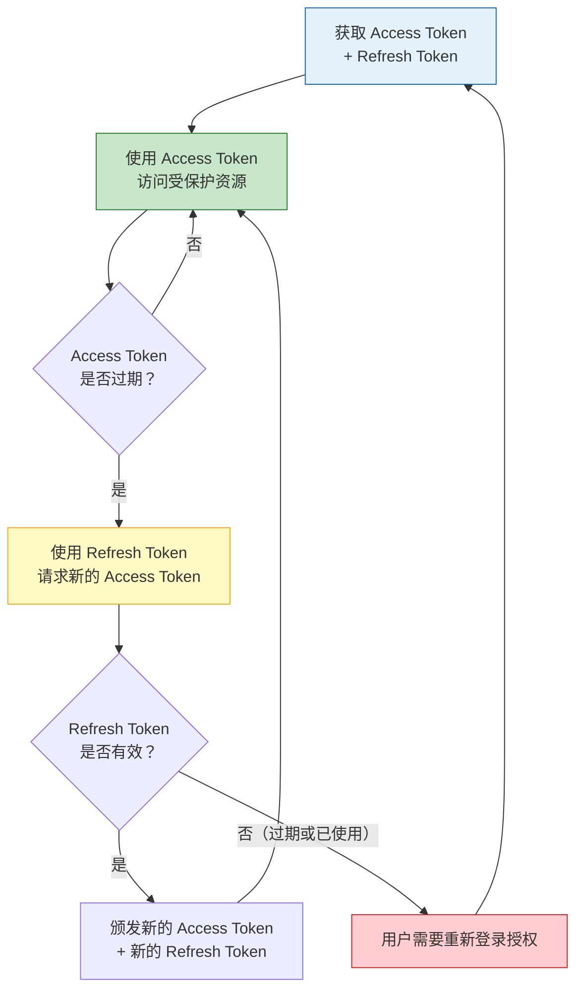

### 9.3 令牌使用方式

```
✅ 正确方式：放在 HTTP 请求头中
Authorization: Bearer <access_token>

❌ 错误方式：放在 URL 查询参数中
GET /api/resource?access_token=xxx
→ 容易通过浏览器历史、日志、Referer 头泄露
→ OAuth 2.1 已明确禁止此方式
```

---

## 十、OAuth 2.1 安全增强

OAuth 2.1 是 OAuth 2.0 的安全演进版本，整合了多年来的最佳安全实践。

### 10.1 主要变更

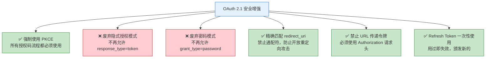

### 10.2 PKCE（Proof Key for Code Exchange）

PKCE 是授权码模式的安全增强扩展，防止授权码被拦截后被滥用。

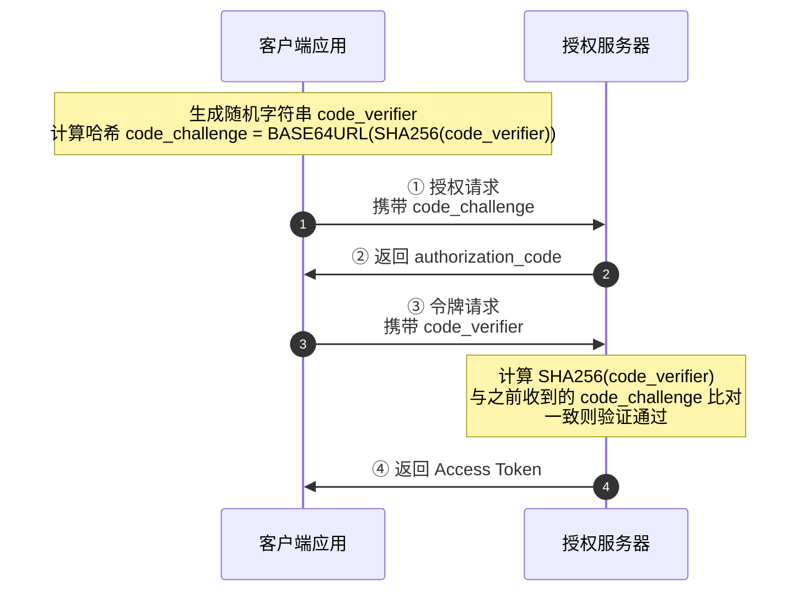

```
PKCE 的作用：
→ 即使授权码在传输过程中被截获
→ 攻击者没有 code_verifier
→ 无法用授权码换取令牌
→ 有效防止授权码拦截攻击
```

### 10.3 OAuth 2.0 vs OAuth 2.1 对比

| 特性 | OAuth 2.0 | OAuth 2.1 |
| --- | --- | --- |
| PKCE | 可选（仅公共客户端推荐） | **强制要求所有客户端** |
| 隐式授权模式 | 支持 | **已废弃** |
| 密码模式 | 支持（不推荐） | **已废弃** |
| redirect_uri 匹配 | 允许模糊匹配 | **强制精确匹配** |
| URL 传递令牌 | 允许 | **禁止** |
| Refresh Token | 可重复使用 | **一次性使用** |
| 授权码模式中令牌传递 | 可能通过 URL 返回 | **强制通过 HTTP 头部传递** |

---

## 十一、安全最佳实践总结

```mermaid
graph TB
    A["OAuth 安全最佳实践"] --> B["令牌存储"]
    A --> C["令牌传输"]
    A --> D["流程选择"]
    A --> E["令牌管理"]
    
    B --> B1["❌ 不要存在 localStorage / sessionStorage"]
    B --> B2["✅ SPA：仅存在内存中"]
    B --> B3["✅ 服务端：加密存储在服务端会话中"]
    B --> B4["✅ 使用 BFF 模式将令牌排除在浏览器之外"]
    
    C --> C1["✅ 使用 Authorization: Bearer 头部传递"]
    C --> C2["❌ 禁止通过 URL 查询参数传递"]
    C --> C3["✅ 始终使用 HTTPS / TLS"]
    
    D --> D1["✅ 所有场景使用授权码模式 + PKCE"]
    D --> D2["❌ 禁止使用隐式授权模式"]
    D --> D3["❌ 禁止使用密码模式"]
    
    E --> E1["✅ Access Token 有效期：15-30 分钟"]
    E --> E2["✅ Refresh Token 一次性使用"]
    E --> E3["✅ redirect_uri 精确匹配"]
    E --> E4["✅ 使用 state 参数防止 CSRF"]
    
    style A fill:#E3F2FD,stroke:#1565C0
    style B fill:#FFF3E0,stroke:#E65100
    style C fill:#E8F5E9,stroke:#2E7D32
    style D fill:#FCE4EC,stroke:#C62828
    style E fill:#F3E5F5,stroke:#7B1FA2
```

---

## 附录：完整的授权码模式 + PKCE 流程

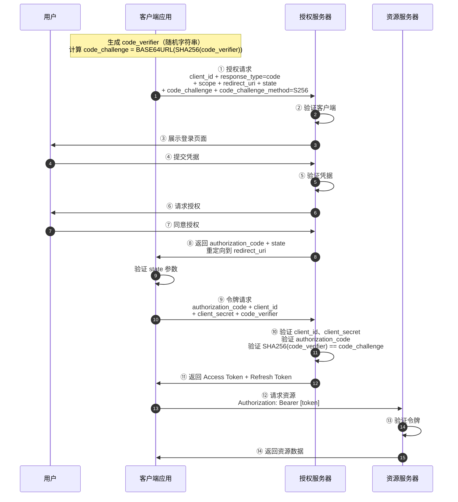