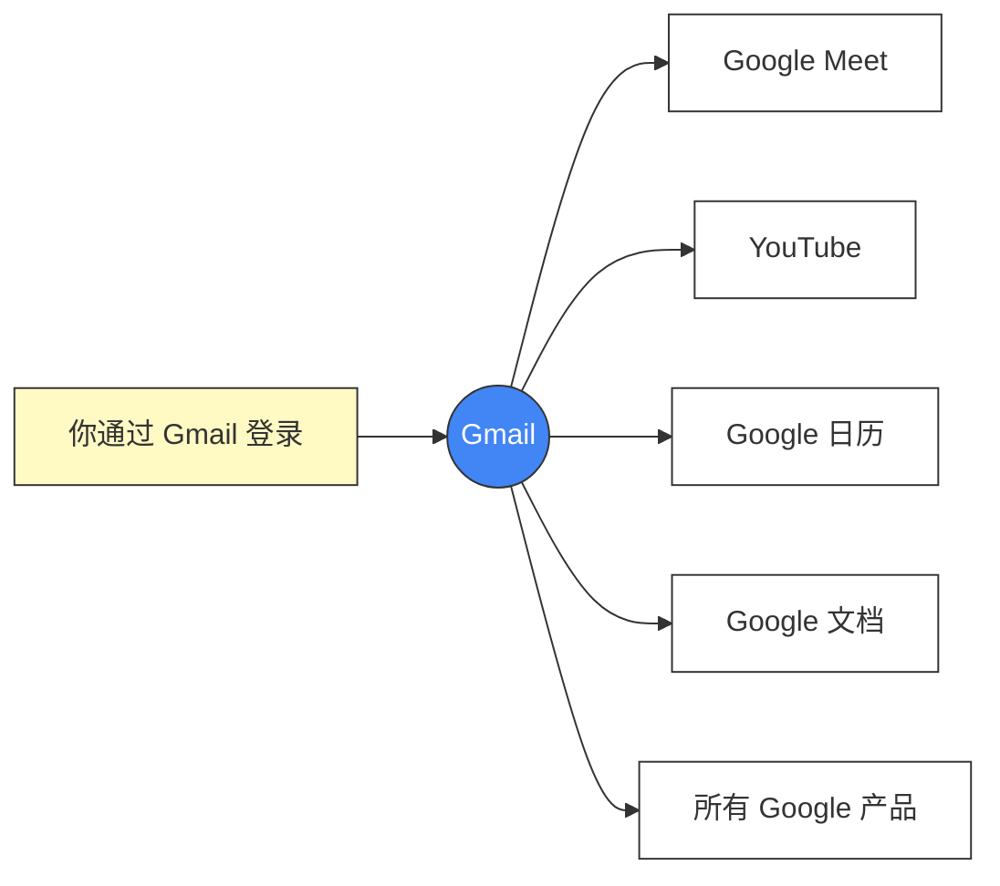
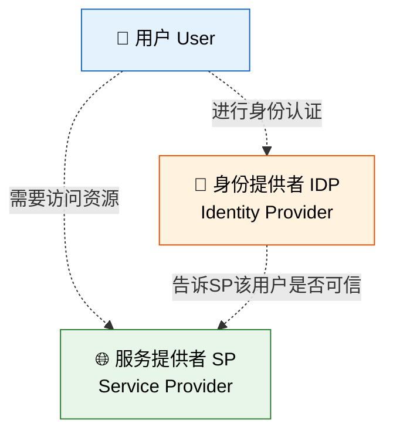
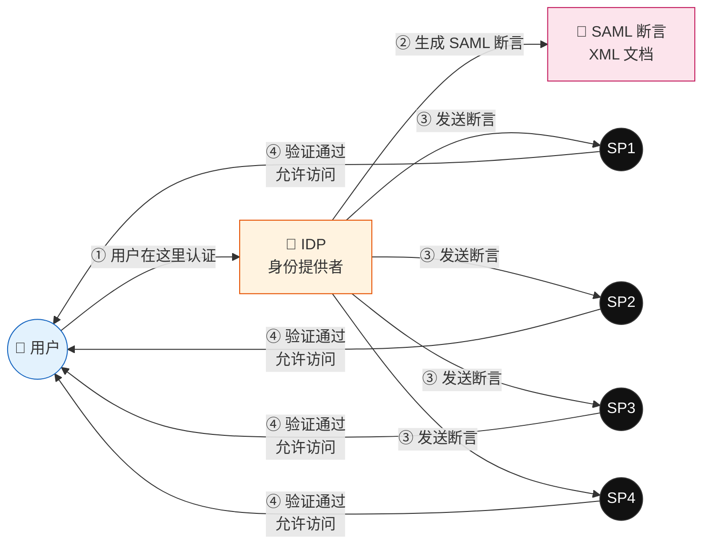
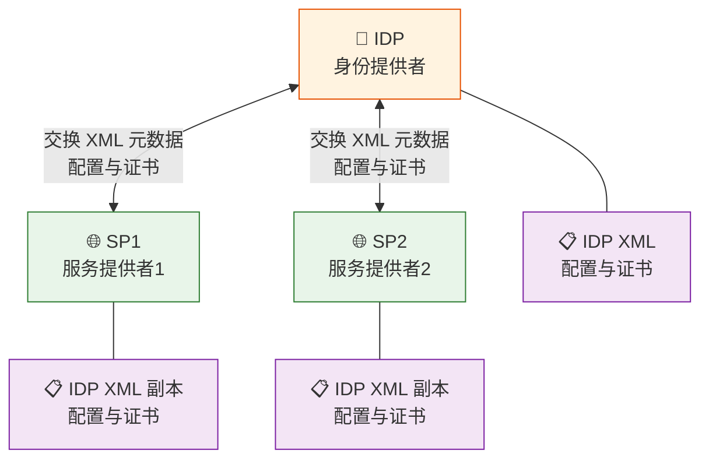
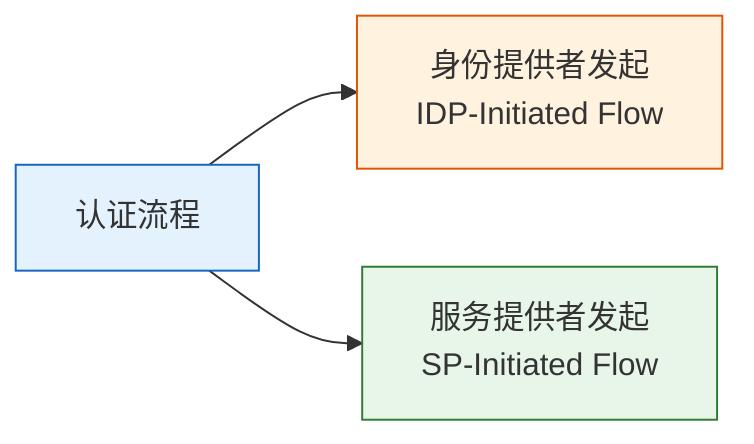
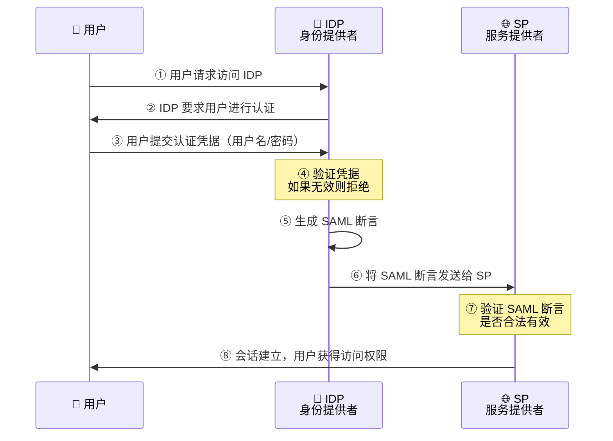
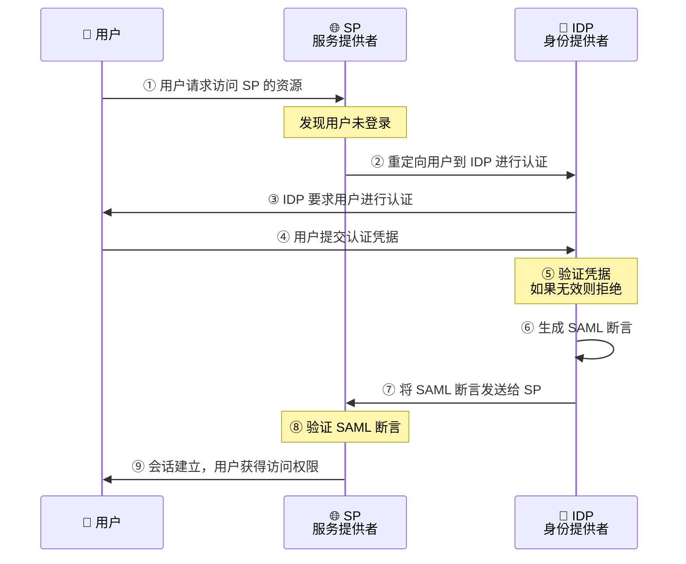
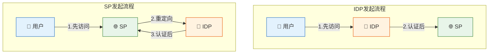
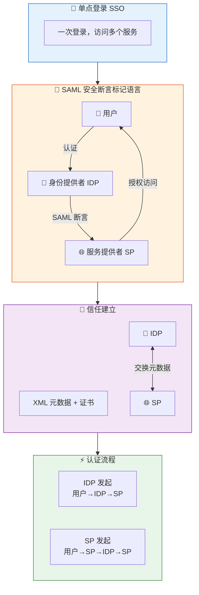

# 单点登录（SSO）完整图解

## 一、什么是单点登录（SSO）？

> 一种身份认证策略，允许用户使用 **一个用户名和密码** 登录多个相关但独立的服务。

### Google SSO示例



**如果没有 SSO**，你需要为每个服务使用不同的账号密码分别登录。有了 SSO，只需登录一次即可访问所有关联服务。

---

## 二、SAML — 安全断言标记语言

> **SAML**（Security Assertion Markup Language）是用于在各方之间交换**身份认证**和**授权**数据的开放标准。

### 三个核心角色



| 角色 | 说明 |
| --- | --- |
| **用户（User）** | 需要访问某些资源的一方 |
| **身份提供者（IDP）** | 确认"用户是谁"以及"用户能做什么"的权威来源 |
| **服务提供者（SP）** | 需要被授权访问的服务 |

---

### SAML 认证流程概览



> **SAML 断言**是一个包含授权信息的 XML 文档，经过数字签名以确保可信性。对于任何未经认证的访问，用户都会被引导到 IDP 进行登录。

---

### SAML 元数据交换（建立信任）



SAML 断言的格式和内容由 SP 和 IDP **预先协商确定**：

| 内容 | 说明 |
| --- | --- |
| **XML 元数据文件** | 分别放置在 IDP 和各个 SP 上 |
| **配置信息** | 例如："我需要在断言中包含用户邮箱" |
| **证书** | 用于验证断言的数字签名，确保数据可信 |

> 这些元数据也被称为 **SAML 元数据（SAML Metadata）**，这种配置交换用于建立双方之间的信任关系。

---

## 三、它是如何工作的？

启动认证流程有 **两种主要方式**：



---

### 方式一：身份提供者发起的流程（IDP 发起）

> 客户端**先请求 IDP** 来启动认证流程。



**详细步骤说明：**

| 步骤 | 说明 |
| --- | --- |
| ① | 用户主动访问 IDP（身份提供者） |
| ② | IDP 返回登录页面，要求用户认证 |
| ③ | 用户输入用户名/密码等凭据 |
| ④ | IDP 验证凭据，无效则拒绝访问 |
| ⑤ | 验证通过，IDP 生成 SAML 断言（签名的 XML） |
| ⑥ | SAML 断言通过浏览器重定向发送给 SP |
| ⑦ | SP 使用预先配置的证书验证断言的签名和内容 |
| ⑧ | 验证通过，SP 为用户建立会话，授予访问权限 |

---

### 方式二：服务提供者发起的流程（SP 发起）

> 客户端**先请求 SP** 来启动认证流程。



**与 IDP 发起流程的唯一区别：**

```plaintext
IDP 发起：用户 → IDP → SP
SP 发起： 用户 → SP → IDP → SP

SP 发起多了一步：用户先访问 SP，
SP 发现用户未登录，将用户重定向到 IDP。
其余步骤完全相同。
```

---

### 两种流程对比



---

## 四、完整流程总览



---

## 五、核心概念速查表

| 术语 | 英文 | 含义 |
| --- | --- | --- |
| 单点登录 | SSO (Single Sign-On) | 一次登录，访问多个服务 |
| 安全断言标记语言 | SAML | 交换认证和授权数据的开放标准 |
| 身份提供者 | IDP (Identity Provider) | 负责认证用户身份的权威来源 |
| 服务提供者 | SP (Service Provider) | 提供用户要访问的服务 |
| SAML 断言 | SAML Assertion | 包含用户认证信息的签名 XML 文档 |
| SAML 元数据 | SAML Metadata | IDP 和 SP 之间交换的配置信息和证书 |
| IDP 发起流程 | IDP-Initiated Flow | 用户先访问 IDP，再跳转到 SP |
| SP 发起流程 | SP-Initiated Flow | 用户先访问 SP，再重定向到 IDP 认证 |

---

## 六、注意事项

```plaintext
📝 说明

SAML 是一个复杂的主题。
本文中的部分细节已被有意省略或简化，
目的是让读者更容易理解核心概念。

实际生产环境中还需要考虑：
  • SAML 2.0 协议的具体绑定方式（HTTP-POST / HTTP-Redirect）
  • 断言的加密与签名细节
  • 会话管理与单点登出（SLO）
  • 与 OAuth 2.0 / OpenID Connect 的集成
```